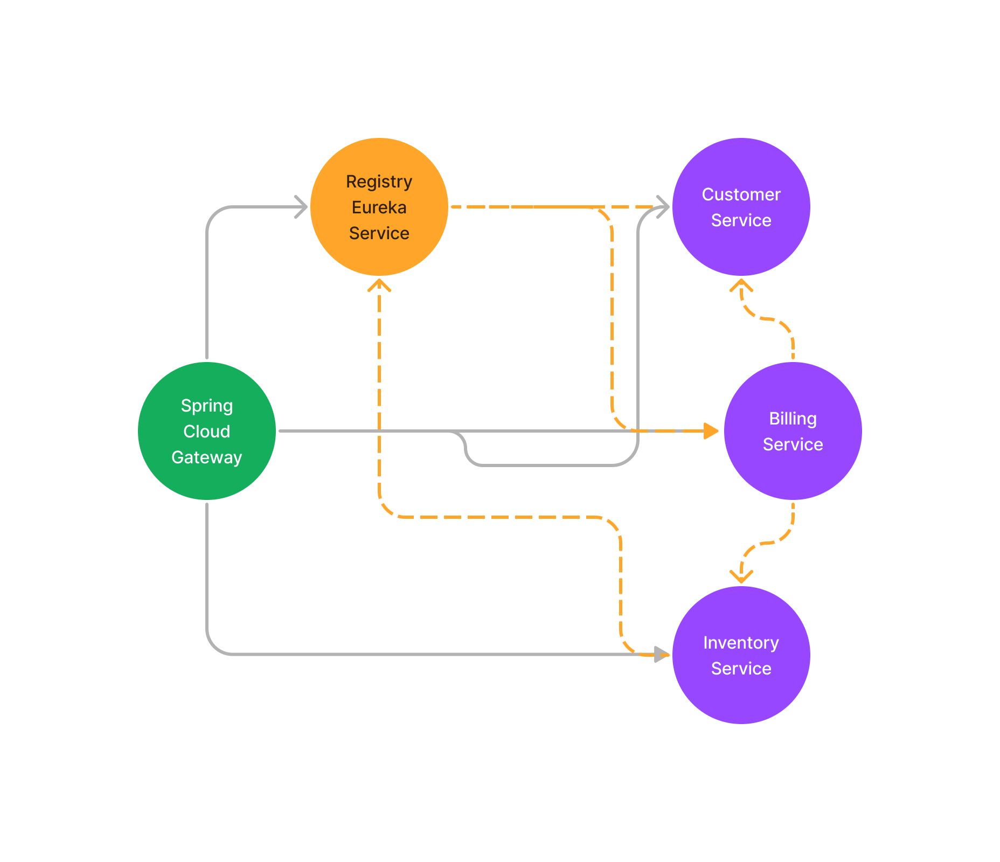
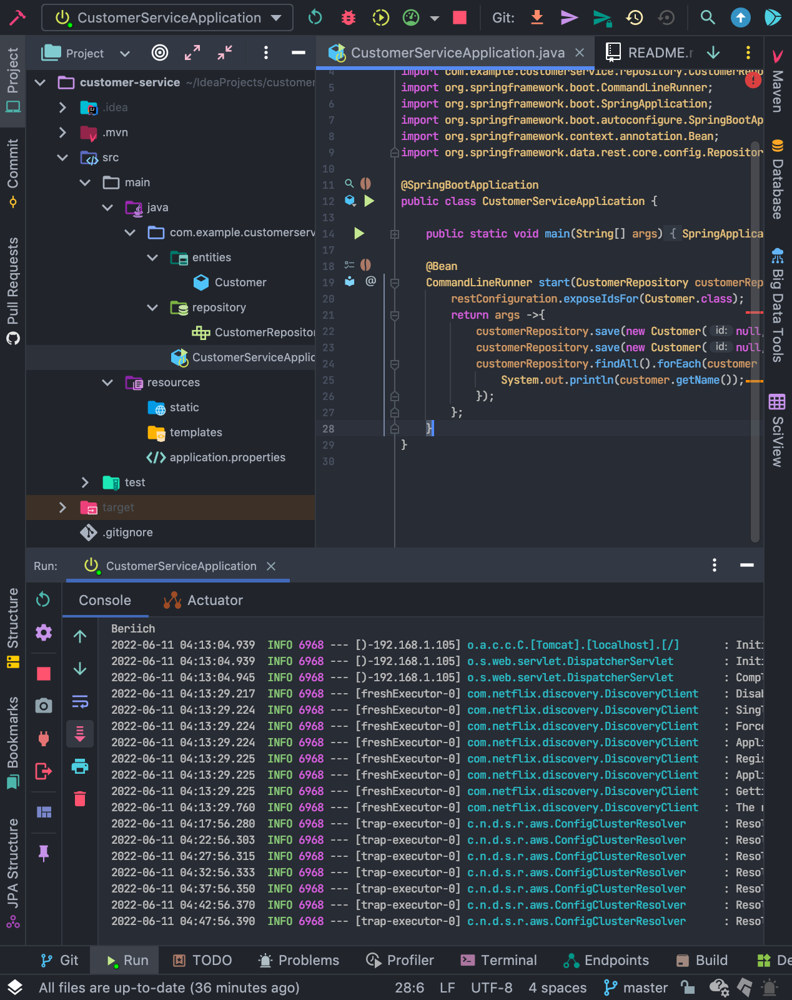
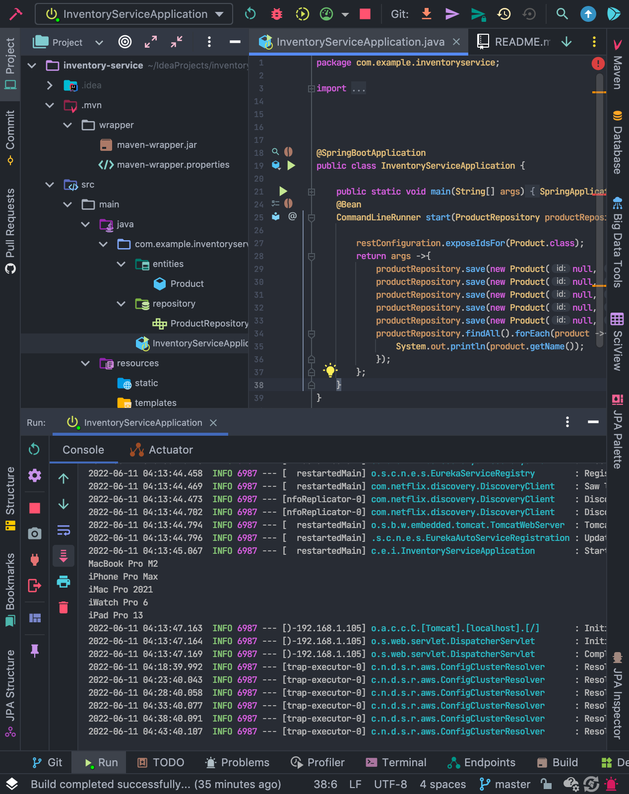
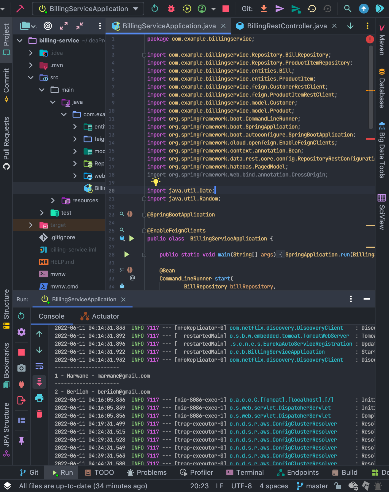
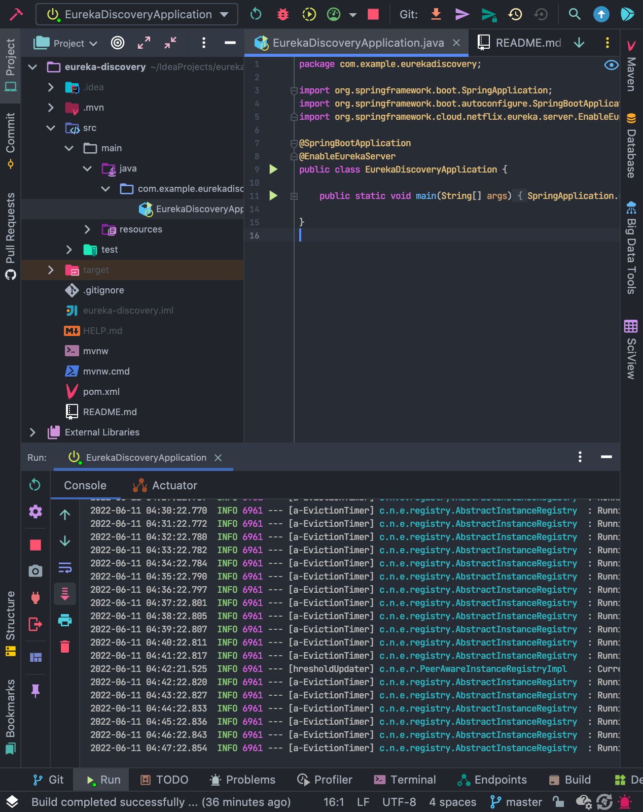
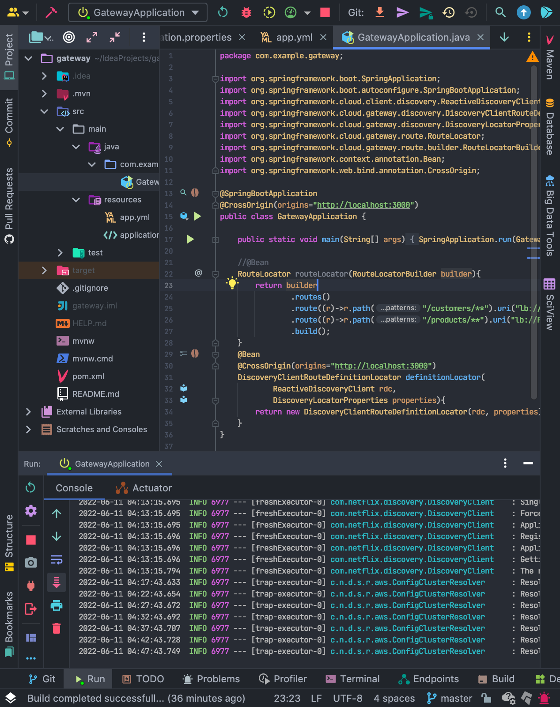

# RapportMS-JEE

## Introduction

L’objectif est de créer un système distribué basé sur les micro-services permettant de gérer les factures des clients en utilisant la même architecture que vous avez déjà développé auparavant en y intégrant un système de sécurité basé sur Keycloak, Un Bus de messagerie avec KAFKA, un service de Stream processing avec Kafka Streams et un service de Batch Processing avec Spring Batch.

## 1 - Architecture du Projet

### Conception

Pour construire ce projet on va suivre l'architecture des MicroServices suivant:

1. Customer-Service
2. Inventory-Service
3. Billing-Service
4. Eureka Discovery Service
5. Spring Cloud Gateway

### Implementation

Chaqu'un de ces Microservices a sa propre base de données.
Et par la suite en va voir en details les structure de chaque microservice:

`1. Customer-Service`

`2. Inventory-Service`

`3. Billing-Service`

`4. Eureka Discovery Service`

`5. Spring Cloud Gateway`

## 2 - Test du Partie Backend

Pour garantie le bon fonctionnement des API qu'on a developer, on a utiliser les outils suivants:

