# Rapport MS-JEE

## Introduction

L’objectif est de créer un système distribué basé sur les micro-services permettant de gérer les factures des clients en utilisant la même architecture que vous avez déjà développé auparavant en y intégrant un système de sécurité basé sur Keycloak, Un Bus de messagerie avec KAFKA, un service de Stream processing avec Kafka Streams et un service de Batch Processing avec Spring Batch.

## 1 - Architecture du Projet

### Conception

Pour construire ce projet on va suivre l'architecture des MicroServices suivant:

1. Customer-Service
2. Inventory-Service
3. Billing-Service
4. Eureka Discovery Service
5. Spring Cloud Gateway

### Implementation

Chaqu'un de ces Microservices a sa propre base de données.
Et par la suite en va voir en details les structure de chaque microservice:

`1. Customer-Service`

`2. Inventory-Service`

`3. Billing-Service`

`4. Eureka Discovery Service`

`5. Spring Cloud Gateway`

## 2 - Test du Partie Backend

Pour garantie le bon fonctionnement des API qu'on a developer, on a utiliser Insomnia, une outil de RESTClient :

#### Dans cet partie on va essayé d'accées au les MicroServices, et obtenir les donnnées.

`A-1. GET Bills`

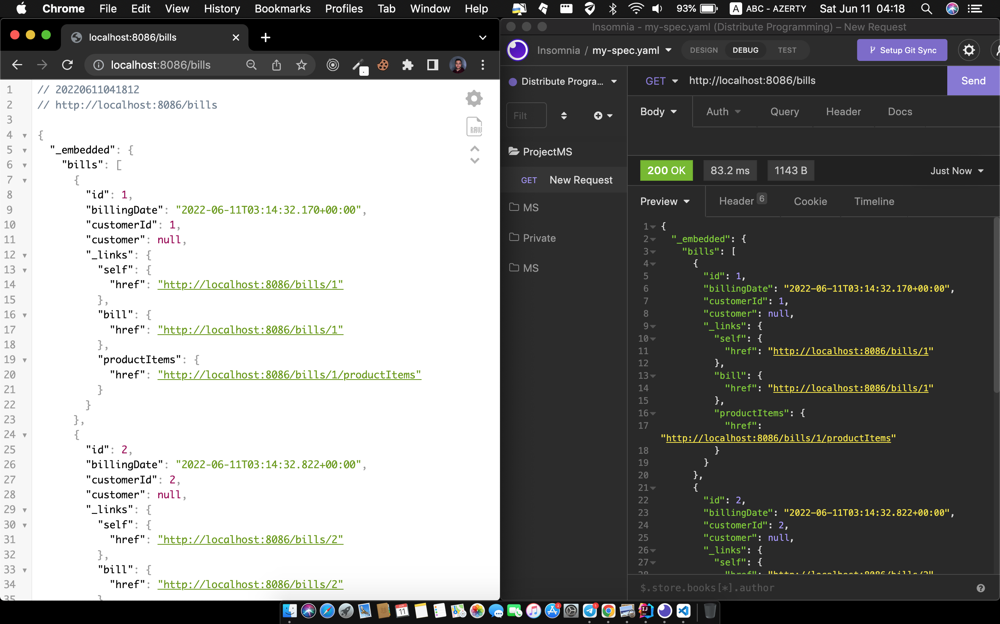

`A-2. GET Customers`

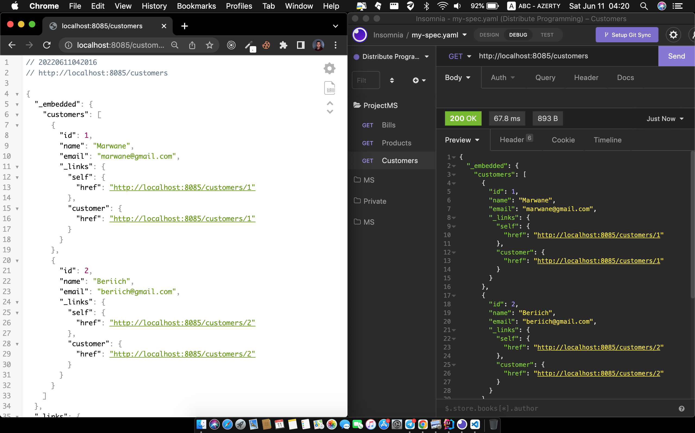

`A-3. GET Products`

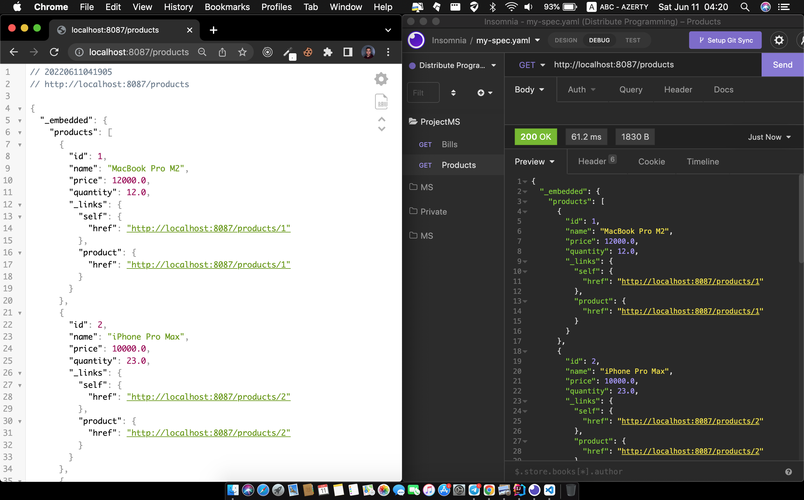

#### Dans cet partie on va essayé d'accées au les MicroServices, et obtenir les donnnées.

`B-1. POST Bills`

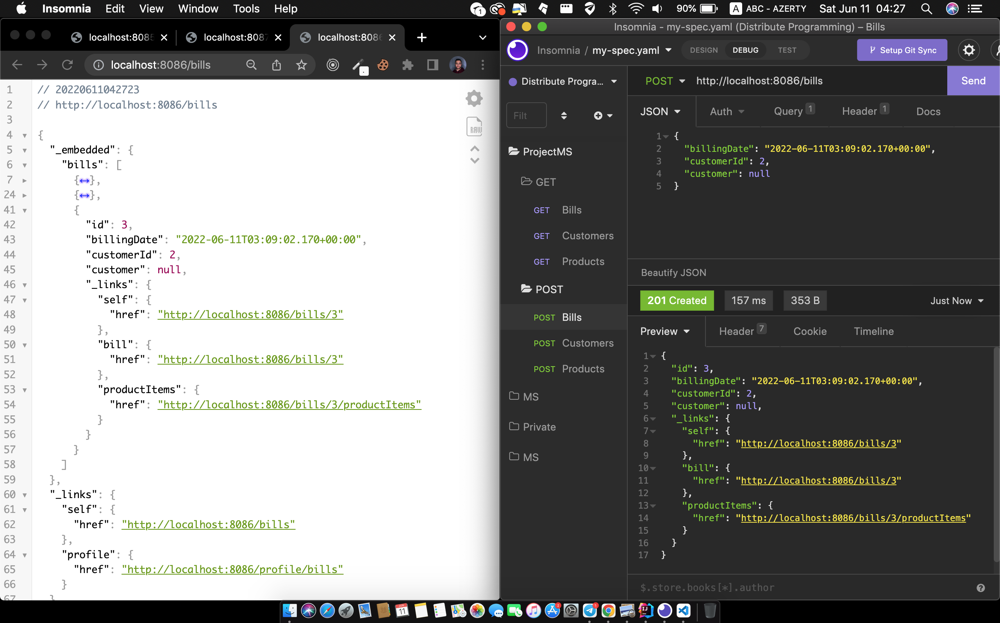

`B-2. POST Customers`

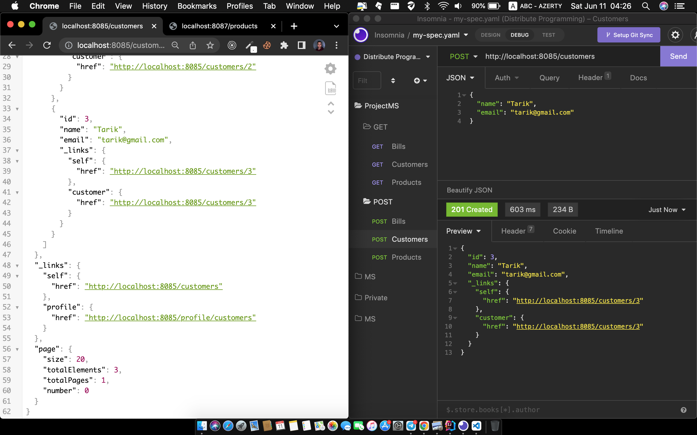

`B-3. POST Products`

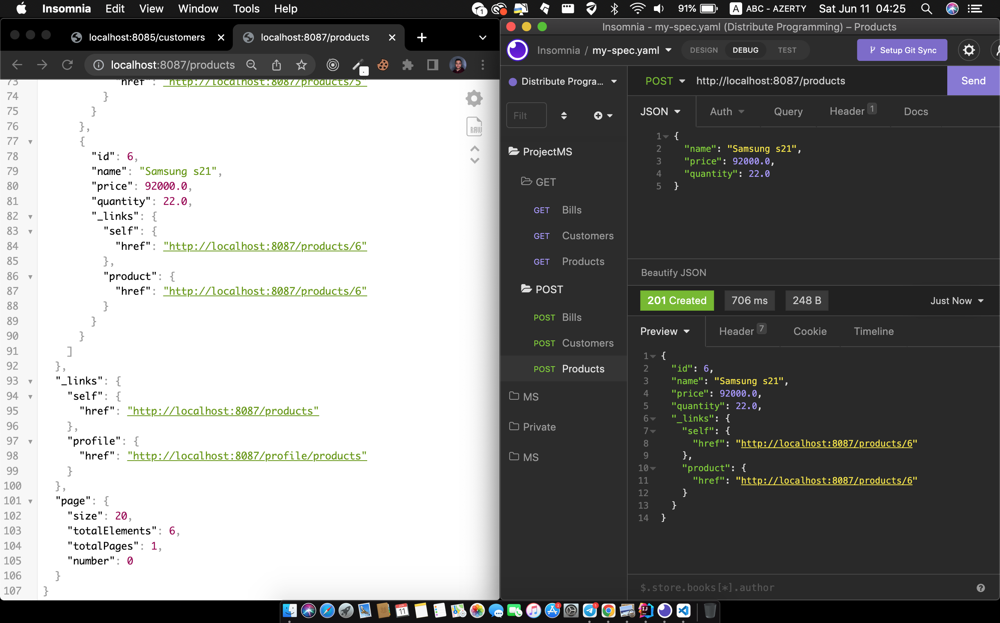

## 3 - Test du Partie Frontend

Pour cet partie on va voir l'implimentation du Frontend utilison la technologie `REACT.js` avec `Tailwind CSS`.

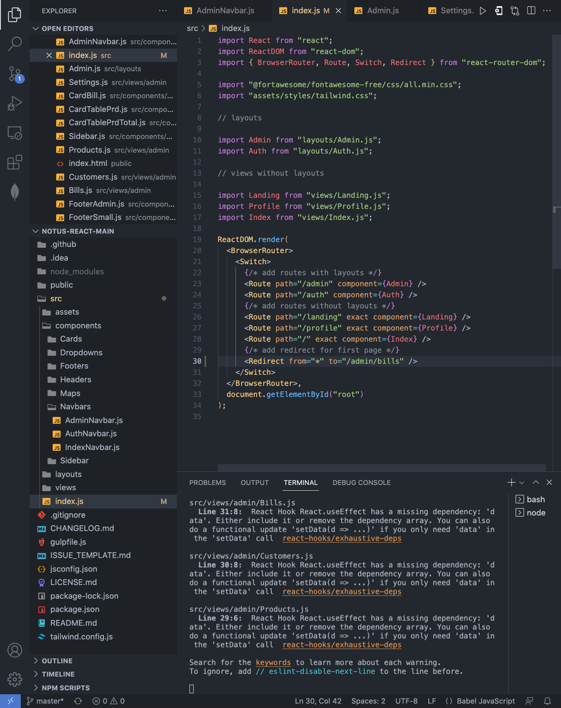

Et par la suite on va voir les parties réaliser :

`1. Produits`

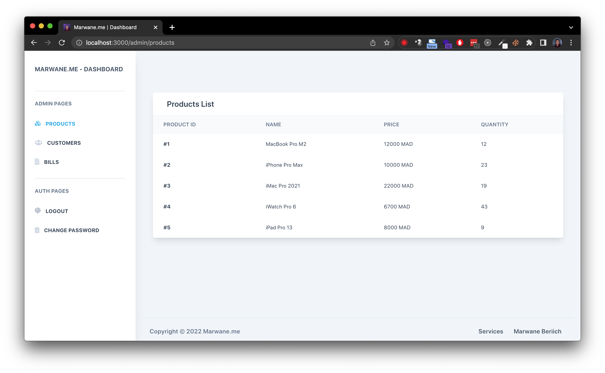

`2. Clients`

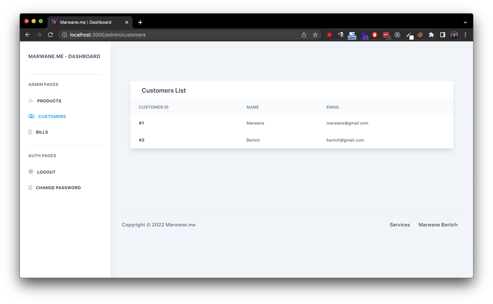

`3-a. Factures`

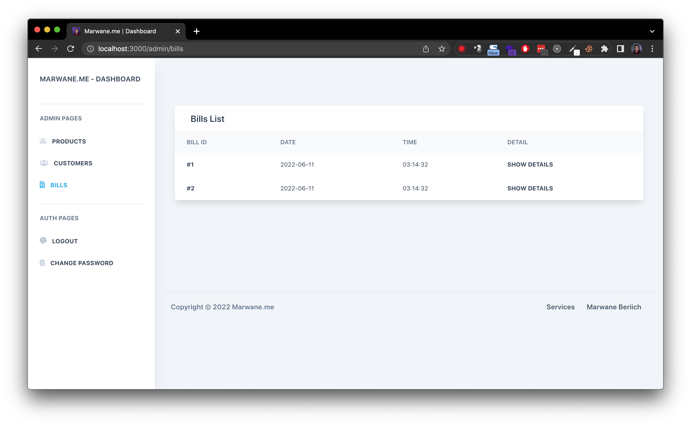

`3-b. Détail de facture`

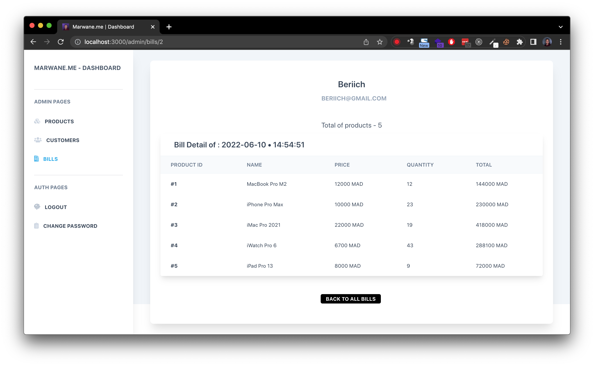

## 4 - Quelle est la prochaine étape ?

Mon prochain objectif est d'intégrer KAFKA dans un nouveau MicroService qui va générer des factures du maniere aléatoire. Et d'ajouter ce MicroService dans mon systéme complet.

Ainsi que d'ajouter des couches de sécurité au `Frontend` et `Backend` utilisons Keycloak, j'ai déja commencer de l'integrer mais je rencontre des problèmes dans la partie du Bearer-Only.

## Conclusion

Je tiens de merci Mr. Youssfi pour cet formation qui m'a motivé de continuer mes autoformations dans ce sense là, et de réaliser plus des projets.

